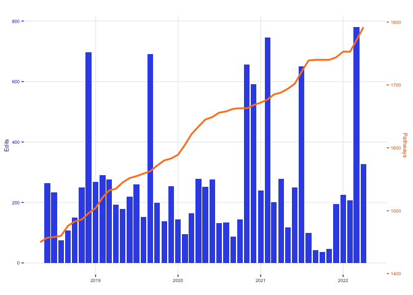

# WikiPathways Stats

This R notebooks prepares figures to summarize WikiPathways activity.
The output files are displayed on the website and used in publications
and grant applications. Please edit in coordination with the
WikiPathways development team.

-   Data points are collected in \_*data/*
-   Plots are saved in *assets/img/*

## Collect Data

### Initialize Pathway Count Table

Collect history from old webservice, using getPathwayHistory on
“Approved” pathways and checking oldest revision on pathways after
WP3959 against a cutoff “oldest.date”.

**This was used to populate the data table; only run once.** See GitHub
Collections to update the table using data sourced from GitHub repos.

### Initialize Monthly Activity Table

Collect monthly edit history from “User edits in month” from old server
at *wpi/statistics/editCounts.txt*, manually simplified to
*editCounts.csv*.

**This was used to populate the data table; only run once.** See GitHub
Collections to update the table using data sourced from GitHub repos.

### GitHub Collections

``` r
wpid.all.df.cnts <- read.csv("../_data/pathway_counts.csv", stringsAsFactors = F)
edits.user.df <- read.csv("../_data/edit_counts.csv", stringsAsFactors = F)

# TODO: count WP folders in _pathways/
# TODO: commits per time frame, see https://git-scm.com/docs/git-rev-list with
# parms --since and --until
```

## Plot data

Composite plot for main page: pathway count and number of edits per
month.

First, let’s combine our data frames and make a proper date column and
factor by month

``` r
combo.df <- edits.user.df %>%
  full_join(wpid.all.df.cnts, by="date")

combo.df$date <- strptime(paste0(combo.df$date,"01"), "%Y%m%d")
combo.df$month <- factor(format(combo.df$date, "%B"),
                                levels = month.name)
```

Next, let’s plot a time series

``` r
# RColorBrewer::display.brewer.all()
bcols <- RColorBrewer::brewer.pal(3,"Set1")

# scaling
ylim.prim <- c(0, max(combo.df$edits, na.rm = T)) # range for edits
ylim.sec <- c(min(combo.df$pathways, na.rm = T), max(combo.df$pathways, na.rm = T))    # range for pathways
b <- diff(ylim.prim)/diff(ylim.sec)
a <- b*(ylim.prim[1] - ylim.sec[1])

p <- ggplot(combo.df) +
  geom_bar(aes(x = as.Date(date),y=edits),stat="identity", fill=bcols[2]) +
  geom_line(data=combo.df[which(combo.df$month %in% c("February","December")),], # hand-picked dates due to patchy pathway counts
            aes(x = as.Date(date),y=a + pathways * b), 
            color = bcols[1], size = 2) +
  scale_x_date(date_breaks = "1 year", date_labels = "%Y",
               name = "",
               limits = c(as.Date(strptime("2018","%Y")),as.Date(strptime("2022","%Y")))) +
  scale_y_continuous(name="# Edits",  
                     sec.axis=sec_axis(~ (. - a)/b, 
                                       name="# Pathways")) +
  ggtitle("Active community and growing database") +
  xlab("") +
  theme(axis.text.y.left=element_text(colour=bcols[2]),
        axis.text.y.right=element_text(colour=bcols[1]),
        axis.ticks.y.left=element_line(colour=bcols[2]),
        axis.ticks.y.right=element_line(colour=bcols[1]))


p
```

    ## Warning: Removed 13 rows containing missing values (position_stack).

    ## Warning: Removed 2 row(s) containing missing values (geom_path).



``` r
ggsave("../assets/img/main_stats.png", plot = last_plot(), 
       width = 1100, height = 550, units = "px", dpi = 250)
```

    ## Warning: Removed 13 rows containing missing values (position_stack).

    ## Warning: Removed 2 row(s) containing missing values (geom_path).
